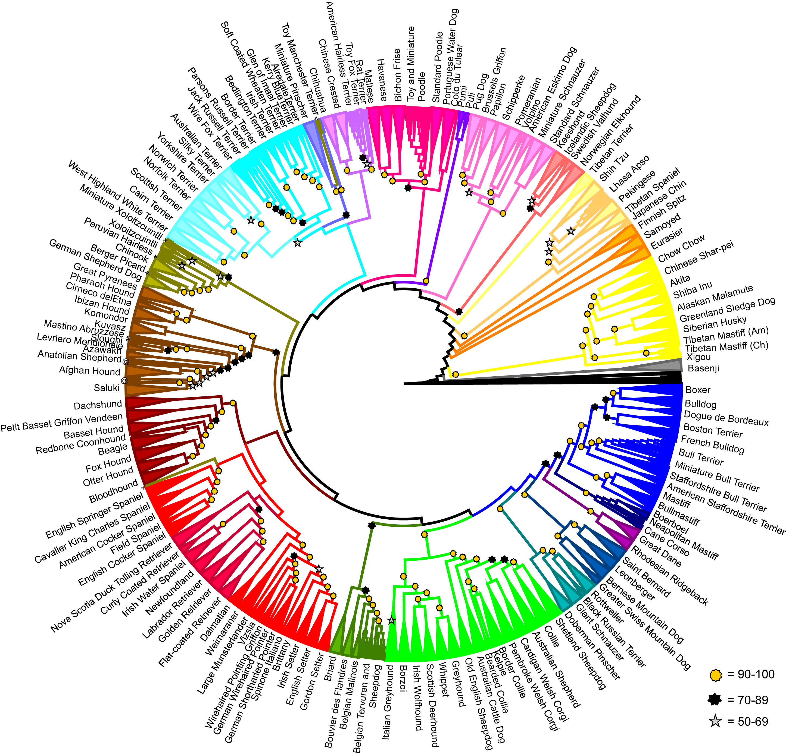
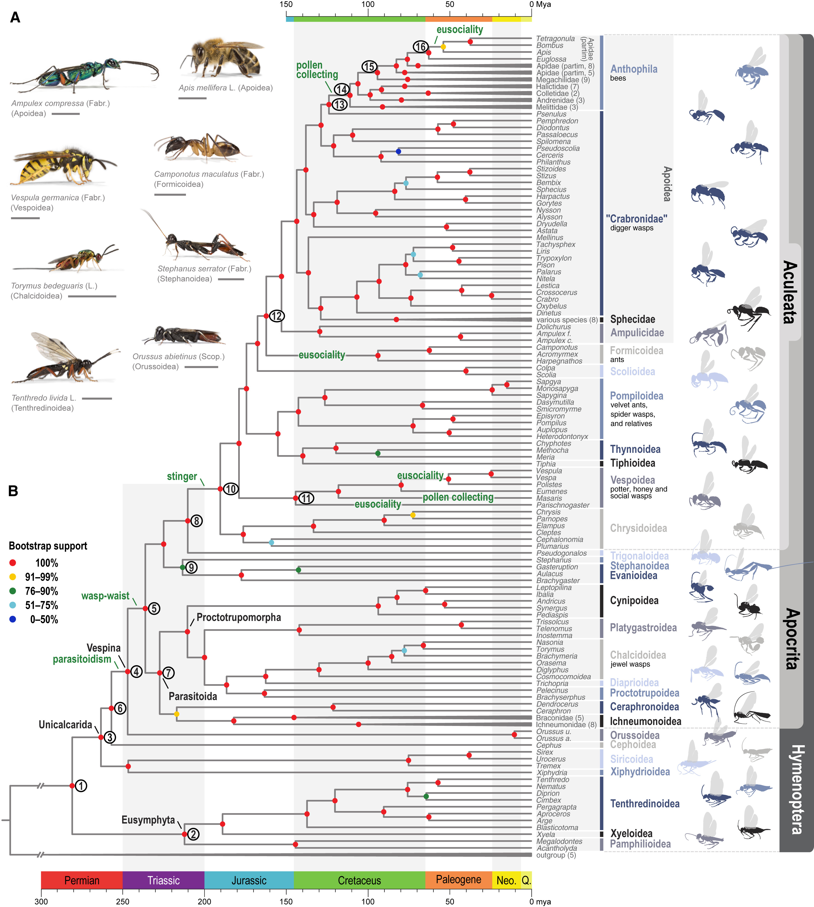
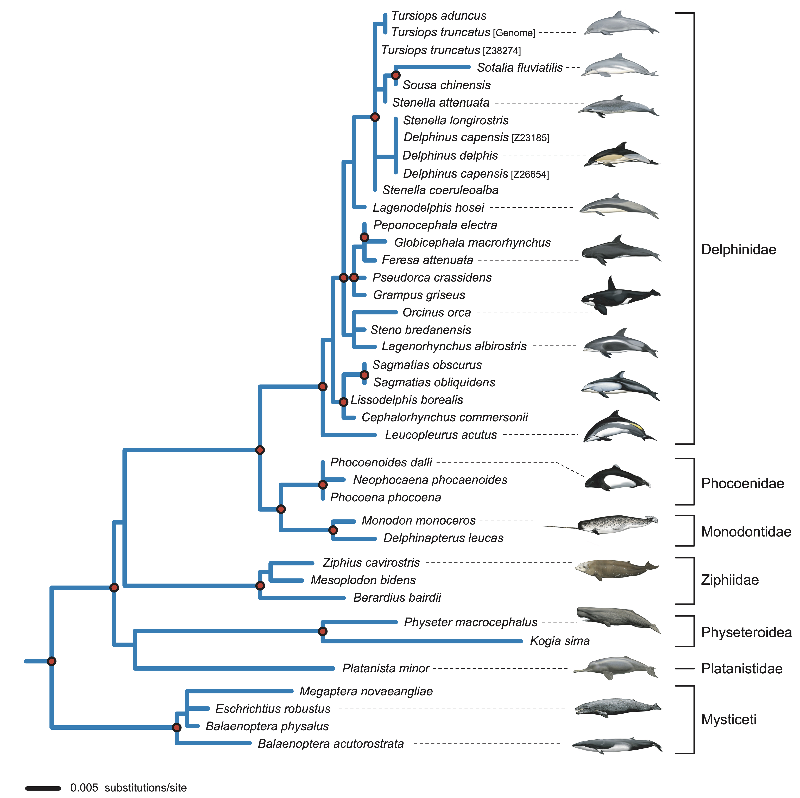

# Phylogenetic trees and where to find them {#phylogenetics}

This chapter is a brief overview of some key concepts that may be useful when performing comparative research.
```{r , include=FALSE}
knitr::opts_chunk$set(echo = FALSE)
```

## Phylogeny

Phylogeny is the term used to describe the evolutionary history of a group of species. The most common representation of phylogeny is a phylogenetic tree. There is a lot of terminology around phylogenetic trees. Here we will start with the very basics that will come up a lot in this book.

The **tips** of the tree represent the species/populations/individuals described by the tree. The **branches** of the tree represent the pattern of relationships between species. The **nodes** of a tree represent the most recent common ancestor of the lineages that diverge from that node. A **clade** is a monophyletic grouping of lineages. A grouping is **monophyletic** only if all members of that group descend from a common ancestor to the exclusion of others. For example, humans and apes form a monophyletic grouping but humans, apes and parrots do not.

Here is an example of a phylogenetic tree displaying the relationships of modern dog breeds taken from a nice paper investigating the evolutionary history of the domestic dog [@Parker17]
```{r, eval = TRUE, echo = FALSE, fig.cap="Cladogram of 161 domestic dog breeds taken from Parker et al 2017."}

```

The tree shown above is a **cladogram** meaning that the lengths of the branches do not carry any real meaning. This tree is only useful for interpreting the relatedness of the species. It does not give us any information about the amount of evolutionary change or the amount time between nodes.

By contrast, the following tree has **branch lengths**. The tree is based on genetic analysis of 173 species of hymenoptera (bees, ants and wasps) [@Peters17]. In this tree, the branch lengths represent time (in millions of years) as calculated from analysis of over 3,000 genes and calibrated using fossils.
```{r, eval = TRUE, echo=FALSE, fig.cap="Time-calibrated phylogeny of Hymenoptera from Peters et al 2018."}

```

Branch lengths do not always represent evolutionary distance as time. In some cases, evolutionary distance is represented as the amount of change on each branch. The next tree was built based on a brain development gene (MCPH1) in cetaceans (whales, dolphins and porpoises) [@McGowen11]. On a tree like this, longer branches indicate more character changes along the branch. In this case the character changes will be changes in genetic sequence but for other trees it may be morphological characters, protein sequences or a combination of molecular and morphological traits.
```{r, eval = TRUE, echo=FALSE, fig.cap="Phylogeny of MCPH1 brain development gene in 38 cetacean species from McGowen et al 2011."}

```

## Building trees

Developments in the field of phylogenetics have meant that there are many ways to construct a phylogeny. Many of the modern methods are highly sophistaicated and for now, these are not the subject of this book. However, it may help you to have a brief introduction to the logic behind building a phylogeny.

For three species, there are only 3 possible phylogenies.

```{r, eval=TRUE, echo=FALSE, fig.height=4, message=FALSE, warning=FALSE}
require(ape)
t1 <- read.tree(text = "((A,B),C);")
t2 <- read.tree(text = "((A,C),B);")
t3 <- read.tree(text = "((C,B),A);")
par(mfrow = c(1,3))
plot(t1, label.offset = .2, cex = 2, edge.width = 4)
plot(t2, label.offset = .2, cex = 2, edge.width = 4)
plot(t3, label.offset = .2, cex = 2, edge.width = 4)
rm(t1,t2,t3)
```

For 5 species, there are 105 possible phylogenies. For 10 species, there are 34.5 million possible trees! Clearly we need a great deal of computational power to distinguish between all these possibilities.

To understand the scale of this problem, it may be useful to contemplate the tale of *The Maharaja's Rice*, a legend in Hindu fokelore. The legend goes that a local king would challenge visitors to a game of chess. Such was the confidence of the king that if the visitor defeated him, they could name their reward. One day, a humble traveller accepted the challenge and named a few grains of rice as his reward. If he won, the king would have to place one grain on the first square of the board, 2 on the second square, 4 and third and so on, doubling the number for each square.

Delighted by the apparently low stakes, the king accepted but to his dismay, lost the game. Humbled by defeat, he called for a sack of rice to settle the debt. As he began laying out the grains, he realised that the traveller had tricked him.

```{r eval=TRUE, echo=FALSE, message=FALSE, warning=FALSE}
x <- 2^(1:64)/2
y <- 1:64
z <- data.frame(x,y)
require(ggplot2)
require(png)
require(grid)
img <- readPNG("Images/chess.png")
g <- rasterGrob(img, interpolate=TRUE)
ggplot(data = z, aes(x = y, y = x)) +
  geom_line(size = 1) +
  labs(x = "Squares on the Board", y = "Grains of Rice") +
  theme_minimal() +
  annotation_custom(g, xmin=10, xmax=45, ymin=2e17, ymax=1.2e19)
rm(g,img)
```

The amount of rice grew exponentially. On the $\text{32}^{\text{nd}}$ square, there were 2 billion grains of rice. On the $\text{64}^{\text{th}}$ and final square alone, there would be $1.8 \times 10^{19}$ grains which equates to over 200 billion tons of rice. The traveller revealed himself as Krishna and allowed the king to repay the debt over time. To the present day, people visiting the area are served Paal Paysam to repay the debt to Krishna.

The point here is that we are generally very poor at considering very large numbers and when we are dealing with phylogenetics, it is a good idea to bear this in mind. Consider the vast number of possible relationships there are between the almost 6,000 species of mammal!

Obviously we need to narrow down the possibilities to something more reasonable. The process of building a tree is always the same. Compare a number of traits across a group of species and determine the points of similarity and difference. The more similar two species are, the more closely related they will be in the resulting phylogeny. Let's have a look at how this works with different traits

### Morphology

Classically, species were sorted into groupings based on morphological similarity. For example, the following table is a character matrix for 5 traits across 6 species. The presence of a character is indicated by 1 and the absence by 0.

```{r message=FALSE, warning=FALSE, echo=FALSE, eval=TRUE}
Lancelet <- rep(0,5)
Lamprey <- c(1,0,0,0,0)
Bass <- c(1,1,0,0,0)
Frog <- c(1,1,1,0,0)
Turtle <- c(1,1,1,1,0)
Leopard <- c(1,1,1,1,1)
x <- data.frame(Lancelet, Lamprey, Bass, Frog, Turtle, Leopard)
rownames(x) <- c("Backbone", "Hinged Jaw", "4 Limbs", "Amnion", "Hair")
knitr::kable(x, align = "c")
rm(Lancelet, Lamprey, Bass, Frog, Turtle, Leopard, x)
```

We can use this matrix to construct a cladogram. Evidently the turtle and leopard have the most in common (4 out of 5 traits) and then the frog has 3 traits in common with both of them. In this way, we can build our tree.

```{r message=FALSE, warning=FALSE, echo=FALSE, eval=TRUE}
t <- read.tree(text = "(((((Leopard,Turtle),Frog),Bass),Lamprey),Lancelet);")
require(ggtree)
ggtree(t) +
  geom_tiplab(offset = .1, size = 5) +
  xlim(0,6)
```

Using morphological similarity is simple enough because the traits are mostly easily observable. However, we need to be careful. The choice of trait is vitally important here. For example, we may be in danger of mistaking homologous traits and analogous traits. Flight adaptations in birds, bats, pterosaurs and insects represent examples of distantly related animals converging on similar triats and certainly not common descent.

Let's take the example of cetaceans (whales, dolphins and porpoises). Historically, some had thought cetaceans were large fish with sources as late as the $\text{17}^{\text{th}}$ century CE referring to porpoises as fish. This is despite ancient sources such as Aristotle who noted their remarkable similarity to terrestrial vertebrates in the $\text{4}^{\text{th}}$ century BCE. By the $\text{18}^{\text{th}}$ century CE, cetaceans were formally recognised as mammals but even then, it was clear that were very different.

So how should we classify them? A nice common sense grouping might be alongside the other aquatic mammals. This would create a marine mammal clade of cetaceans, pinnipeds (seals & sea lions) and the sirenians (manatees & dugong). We might even place partially aquatic species like polar bears and otters as an outgroup to this clade.

The problem here is that *living in the water* is not really a phylogenetically informative trait. It's the same trap people fell into when they classified whales as fish. What we need is to select traits that are phylogenetically informative, meaning that similarity in such traits is likely to reflect homology rather than analogy.

Often, tooth and jaw morphology are prominent in phylogenetics. These are hard-wearing parts of the skeleton that fossilise easily and since they are involved in feeding, they can tell you a lot about the animal. This makes them good sources of information when we can find them. Cladistic analyses based on morphological characteristics placed cetaceans as the sister group to a carnivorous group of extinct mammals called the mesonychids.

This intially made sense as cetaceans are carnivorous and this agreed with Darwin's 1859 postulation that cetaceans could have arisen from some form of swimming bear which gradually became more and more adapted to marine life. Upon closer inspection, mesonychids were found to have morphological similarities to artiodactyls (even-toed ungulates) and the clade was moved from carnivora to be a sister group of the artiodactyls.

```{r eval=TRUE, echo=FALSE, message=FALSE, warning=FALSE}
t <- read.tree(text = "(((Mesonychia, Cetacea),Artiodactyla),Carnivora);")
ggtree(t) +
  geom_tiplab(offset = .1, size = 5) +
  xlim(0,4)
rm(t)
```

### Molecular data

The relationship of cetaceans was all settled and agreed upon until somebody looked at the molecular data. As you know, all life is connected by DNA and over recent decades, it has become possible to sequence that DNA. This opened up new possibilities for traits to use in phylogenetics.

Molecular traits can be used just like morphological traits. So in the same way we look for similarities in tooth morphology, we can now look for similarities in DNA sequence and protein structure (amino acid sequence) as well. For the cetaceans, molecular analysis showed remarkable similarity between cetaceans and artiodactyls, suggesting that the two groups were monophyletic. The two groups are so closely related genetically, that the orders were combined to give us the presently accepted Cetartiodactyla.

```{r eval=TRUE, echo=FALSE, message=FALSE, warning=FALSE}
t <- read.tree(text = "(((Artiodactyla, Cetacea),Mesonychia),Carnivora);")
ggtree(t) +
  geom_tiplab(offset = .1, size = 5) +
  xlim(0,4)
rm(t)
```

Modern phylogenies are built based on large matrices of characters. Often, morphological and molecular characters are used together to resolve phylogenies.

## Tree structure

Phylogenetic trees are quite broadly available for researchers to use in comparative studies. The coverage of your study lineage will vary depending on how well studied the group is. This section will cover the basics of how phylogenies are represented by computers before pointing you to some of the places you will find trees to use.

To represent a phylogenetic tree we use **Newick format** which consists of nested brackets describing the relationships between pairs of species. Below is an example of a simple 3 species tree in which the two species of echidna are sister taxa and the platypus is the outgroup. Note the placement of the brackets (each pair of brackets wraps around sister taxa). The semicolon at the end is important to signify the end of the text string as well.

$$ ((\text{Short-beaked echidna , Long-beaked echidna})\text{, Platypus}); $$

We can manually write our own tree by passing this exact text string directly to the function **read.tree** in the package **ape** [@ape]. When we plot it, you'll notice that it is a cladogram because we haven't supplied branch lengths.

```{r eval=TRUE, echo=TRUE, message=FALSE, warning=FALSE}
monotremes<-read.tree(text = "((Short-Beaked Echidna,Long-Beaked Echidna),Platypus);")
ggtree(monotremes) +
  geom_tiplab(offset = .1) +
  xlim(0,3)
```

In reality, we know what the branch lengths should be so we can edit the **monotremes** object to include appropriate **edge.length** values.

```{r eval=TRUE, echo=TRUE, message=FALSE, warning=FALSE}
monotremes$edge.length<-c(53.0,10.6,10.6,63.6)
ggtree(monotremes) +
  geom_tiplab(offset = .1) +
  xlim(0,80)
```

In Newick format, these branch lengths would be represented with a colon and the length of the branch as follows.

$$ ((\text{Short-beaked echidna: 10.6 , Long-beaked echidna: 10.6})\text{: 53.0, Platypus: 63.6}); $$

Of course, trees with more species will be much more complex but they will follow this basic format.

R stores phylogenies as objects of class **Phylo**. In the simplest case, this class of object is a list of four elements. **edge** refers to the branches. **Nnode** is the number of internal nodes. **tip.label** is a list of the tip labels (usually species names). **edge.length** is the list of branch lengths.

```{r eval=TRUE, echo=TRUE, message=FALSE, warning=FALSE}
str(monotremes)
```

There is another common way phylogenies are stored within R. This is an object of class **MultiPhylo**. This class of object is essentially a list of objects of class Phylo. This is a common way of storing the results of phylogenetic inferences with some uncertainty. Modern phylogentic methods often produce thousands of trees which all differ very slightly, thus preserving appropriate uncertainty in things like branch lengths and topology.


## Finding trees

There are many places to access publically available phylogenetic trees. This is a non-exhaustive summary of some of the more familiar ones.

### Vertlife

[Vertlife][vertlife] is a website funded by the National Science Foundation which provides species-level phylogenies for terrestrial vertebrates. The website is the product of a great deal of work from multiple projects at multiple institutes. What they have created is one of the best resources anywhere for a comparative biologist!

If you navigate to the [phylogeny subsets][vertlife2] section of the website, you will see that you can get trees covering **amphibians**, **birds**, **mammals**, **sharks** and **squamates** simply by pasting the list of species you want into the window. The trees will be emailed you as soon as they are ready.

This website contains probably the most complete coverage I am aware of for some lineages. Particularly for mammals and birds (two commonly used study groups), the taxonomic coverage is excellent.

### 10ktrees

The [10ktrees][10ktrees] project is similar to Vertlife but restricted to a few lineages of mammal. Namely, this website deals with primates, perissodactyls (odd-toed ungulates), cetartiodactyls (even-toed ungulated and cetaceans) and carnivorans.

These trees are built in a similar methodology to Vertlife (which is more up to date) so you may be better off going to Vertlife for these species. It may be interesting however if you would like to compare the differences between the 10ktrees phylogeny and the Vertlife phylogeny.

### TreeBASE

[TreeBASE][treebase] is a searchable database of papers that have built phylogenetic trees. The search engine built into the site allows you to search by author, title, DOI, abstract and study ID (if you know it). You can also search by the entire citation if you aren't sure which study you are looking for. There are also options to search by tree ID and taxa if you know what you are looking for!

### Primary literature

There are many studies that have sought to build phylogenetic trees for a given lineage. Many of these papers provide the trees for use in the **supplementary information** section of the online publication.

As an example, Figueroa *et al*. [-@Figueroa16] constructed a species-level phylogeny of snakes, covering 1745 species. The tree is provided in Newick format [here][snakes]. In this case, the Newick text is provided as a Microsoft Word document. To make this readable by R, we can simply copy and paste the Newick text into a .txt file and read it in using **read.newick** from the **phytools** package [@phytools].

```{r message=FALSE, warning=FALSE, echo=TRUE, eval=FALSE}
library(phytools)
snakes <- read.newick("snakes.txt")
ggtree(snakes)
```
```{r message=FALSE, warning=FALSE, echo=FALSE, eval=TRUE}
require(phytools)
require(ggtree)
snakes <- read.newick("Data/snakes.txt")
ggtree(snakes)
```

When taking trees from the literature like this, always cite the source of the tree and make sure you are aware of how and why the tree was built. If the tree has been surpassed by subsequent publications or is the subject of ongoing debate in the literature, this is important to be aware of when interpreting results arrived at using the tree.

### tree.drawer

Sometimes, a tree used in a study will not be provided in an easily usable format. In some cases, it may only be provided as a figure in a paper.

When this happens, all is not lost! Liam Revell has developed a function called **tree.drawer** within phytools which allows us to trace over a tree [@phytools]. Simply load the image into R using the **jpeg** package [@jpeg] and trace the tree by pointing and clicking on the graphics window. A full tutorial with examples is available [here][tree.drawer].

## Further info

For more information about phylogenetics in general, the main text (and a very readble source) is *Tree Thinking: An introduction to phylogenetic biology* [@baum12].


[vertlife]: https://vertlife.org/ "vertlife"
[vertlife2]: https://vertlife.org/phylosubsets/ "vertlife2"
[10ktrees]: https://10ktrees.nunn-lab.org/ "10ktrees"
[treebase]: https://www.treebase.org/treebase-web/home.html "treebase"
[snakes]: https://doi.org/10.1371/journal.pone.0161070.s003 "snakes"
[tree.drawer]: http://blog.phytools.org/2017/01/second-video-demo-of-treedrawer-in.html "tree.drawer"