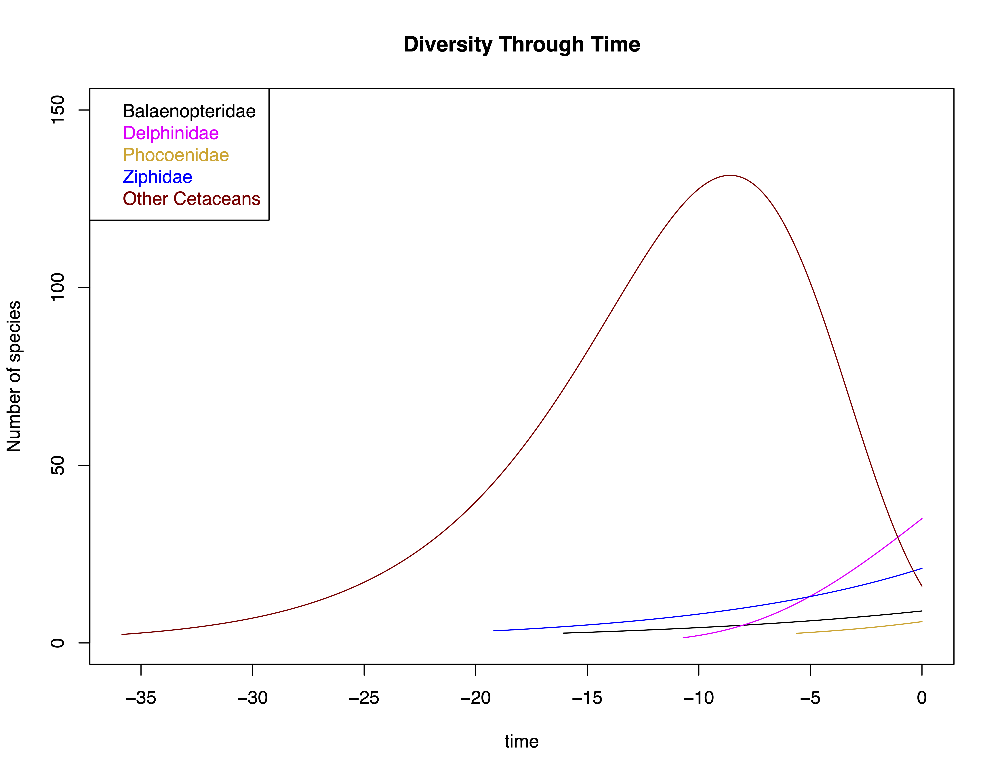

# Diversification {#diversification}

```{r, include=FALSE}
knitr::opts_chunk$set(echo = TRUE)
```

## Introduction

Phylogenetic comparative methods can be used to study the diversification of lineages over time. This can be particularly useful when studying adaptive radiations which are thought to change the rate of speciation. This chapter will begin by studying some diversification models.

### Pure Birth Model

The simplest form of diversification model is a **pure birth** model. Under this model, each lineage has a constant probability of speciating. This probability gives us the **birth rate** (*b*). Over time (*t*), lineages will speciate and thus the number of lineages (*N*) will increase exponentially.

$$ N_{(t)} = N_{(0)}e^{bt} $$
This plot shows how the number of species would grow over time. Note that in this model, there is no extinction and so the exponential increase is because each speciation event produces two daughter lineages which each can then speciate with probabilty *b*, creating two more daughter lineages each and so on.
```{r, echo=FALSE, eval=TRUE, message=FALSE, warning=FALSE}
t <- seq(0,100, by = 5)
b <- .05
N <- c()
N[[1]] <- 1
for(i in 1:(length(t)-1)){
 N[[i + 1]] <- N[[1]] * exp(b*(t[[i + 1]])) 
}
x <- data.frame(N,t)
library(ggplot2)
ggplot(x, aes(x = t, y = N)) +
  geom_point(color = "blue", size = 1.5) +
  labs(x = "Millions of Years", y = "Number of Taxa") +
  geom_smooth(se = FALSE, size = .5)
rm(t,b,N,i,x)
```

As you can probably tell, the pure birth model is not a very good representation of biological reality. For example, today there are around 90 species of cetacean. A pure birth model in which we have *b* set at 0.1 (meaning we have 0.1 new species born every million years) would give us over 1 million species of cetacean in 100 million years.

### The Birth-Death Model

The **birth-death** model incorporates extinction as well as speciation. Under the simplest form of this model, speciation and extinction occur randomly. Each lineage is assumed to have a constant rate of speciation (*b*) and extinction (*d*). Under this model, the number of lineages will increase exponentially with the difference between birth and death rate (*b - d*).

$$ N_{(t)} = N_{(0)}e^{(b-d)t} $$
This graph shows the change in number of taxa over time when the birth rate slightly exceeds death rate.
```{r, echo=FALSE, eval=TRUE, message=FALSE, warning=FALSE}
t <- seq(0,100, by = 5)
b <- .05
d <- .04
N <- c()
N[[1]] <- 1
for(i in 1:(length(t)-1)){
 N[[i + 1]] <- N[[1]] * exp((b-d)*(t[[i + 1]])) 
}
x <- data.frame(N,t)
library(ggplot2)
ggplot(x, aes(x = t, y = N)) +
  geom_point(color = "blue", size = 1.5) +
  labs(x = "Millions of Years", y = "Number of Taxa") +
  geom_smooth(se = FALSE, size = .5)

rm(t,b,N,i,x,d)

```

### The signature of extinction

Let's investigate the differences between pure birth and birth-death models by simulating some trees.

The function **sim.bd.age** in the package **TreeSim** [@treesim] allows us to simulate birth-death trees with a fixed age. First we will set the birth rate $\lambda$ to 0.4 and the death rate $\mu$ to 0 as this is a pure-birth tree. Note that these were *b* and *d* in the previous sections but $\lambda$ and $\mu$ are widely used.
```{r, echo = TRUE, eval = FALSE, message=FALSE, warning=FALSE}
library(ape)
library(TreeSim)
tree1 <- sim.bd.age(age = 10, numbsim = 1, lambda = 0.4, mu = 0)[[1]]
ggtree::ggtree(tree1)
```

```{r, echo = FALSE, eval = TRUE, message=FALSE, warning=FALSE}
library(ape)
library(TreeSim)
load("~/Google Drive/University of Liverpool/GitHub Stuff/bookdownCRG/tree1.Rdata")
ggtree::ggtree(tree1)
```

If you run this command yourself, your tree will look different simply because the simulations will differ each time.

We can plot the pattern of lineage accumulation through time with a lineage-through-time plot. This can be plotted using the function **ltt.plot** in ape [@ape]. Note that because of the expectation of exponential growth, we should log scale the y-axis
```{r, echo=TRUE, eval=TRUE}
ltt.plot(tree1, log = "y")
```

As can be seen from this plot, the increase in lineages over time will be log-linear, just as predicted in previous sections.

What about when we add extinction? We can see here that pure-birth and birth-death trees look quite different. this is because older lineages are more likely to go extinct. This *pull of the present* means that extinction rates appear lower in the present even though there's no reason to assume that they would be any different. We just have a greater proportion of total lineages the closer we are to the present!

```{r, echo=FALSE, eval=TRUE}
simTree1 <- sim.bd.taxa.age(n = 109, age = 10, numbsim = 1, lambda = 0.4, mu = 0)[[1]]
simTree2 <- sim.bd.taxa.age(n = 109, age = 10, numbsim = 1, lambda = 2, mu = 1.6)[[1]]
par(mfcol = c(1, 2))
plot(simTree1, main = "Pure Birth", cex = 0.01)
plot(simTree2, main = "Birth-death", cex = 0.01)
```

## Estimating speciation and extinction rate

Given a phylogeny, we can estimate speciation and extinction rate using the function **birthdeath** in **ape** [@ape].

```{r, echo=TRUE, eval=FALSE}
library(ape)
whales <- read.tree("whaletree.tre")
bd.mod <- birthdeath(whales)
bd.mod
```

```{r, echo=FALSE, eval=TRUE, message=FALSE, warning=FALSE}
library(ape)
library(phytools)
whales <- read.tree("~/Google Drive/University of Liverpool/GitHub Stuff/bookdownCRG/Data/diversification/whaletree.tre")
bd.mod <- birthdeath(whales)
bd.mod
```

The output here gives us some derived values such as $b - d$ (net diversification). If you want to cut straight to the speciation and extinction rates, you can use a **phytools** function called **bd** [@phytools].

```{r, echo=TRUE, eval=TRUE}
phytools::bd(bd.mod)
```

This is a nice start but it assumes constant rates across the tree and that doesn't seem like a reasonable assumption to me. We also may have good reason to doubt that the extinction rate is truly 0!

## MEDUSA

The general birth-death models you have seen so far produce a fairly uniform tree of life. In reality, this isn't actually what we observe. Some clades are highly diverse (such as arthropods) and some are not. This implies that the rates of diversification can vary between lineages.

In fact, based on our understanding of evolution, we would expect rates to change all the time! We know that extinction rates fluctuate around a background rate. For example, extinction rates increase dramatically during mass extinctions. Speciation rates increase during adaptive radiations. The next methods to look at are capable of detecting these changes in rate using phylogenies.

**MEDUSA** stands for Modelling Evolutionary Diversification Using Stepwise AIC [@Alfaro09]. It fits piecewise models of birth and death to our tree and allows us to ask where rates of birth and death may have changed and why clades might differ in size.

MEDUSA fits models to the tree, splitting the tree and allowing the rate to change at each split. The method proceeds by comparing the old model to the new model using AICc to either accept of reject the shift in rate.

Let's see how it works using the phylogeny of cetaceans.
```{r, echo=FALSE, eval=TRUE, warning=FALSE, message=FALSE}
require(geiger)
```

We can run the analysis using the **medusa** function in geiger [@geiger]. All we have to specify here is the tree *phy = whales* and that we want to fit birth-death models *model = "bd"*.

```{r, echo=TRUE, eval=FALSE}
library(geiger)
m1 <- medusa(phy = whales, model = "bd")
```
```{r, echo=FALSE, eval=TRUE}
m1 <- medusa(phy = whales, model = "bd", ncores = 2)
```

There's a lot of information in this output so let's go through it. Firstly, we are told that the appropriate AICc threshold for a tree of this size is 4.4. You may be used to using a change of 2 in AIC as signifiying a significant difference between models. The appropriate threshold for distinguishing between models using MEDUSA varies depending on the size of the tree. Fortunately, the function simply calculates it and reports it to us.

Next we have the stepwise output. In this case we only have 2 steps. Each step is reported to us and in this case, we can see that step 2 involves cutting the tree at node 141. This means that *medusa* has identfied a change in rate at node 141 and continued with the new model from that node.

Finally, the table gives us parameter values for each step. This is very important in interpreting the output. Note that *epsilon* is the extinction rate, previously known as either *d* or $\mu$ and *r* is the net diversification rate ($\lambda - \mu$).

The best way to visualise this analysis is by plotting the models on the tree. When we do so we can see that *medusa* has placed the shift near the root of the Delphinidae (excluding interestingly the orca). We can see that the rate of diversification is much greater in the oceanic dolphins.

```{r, echo=TRUE, eval=TRUE, fig.height = 9, out.width="100%"}
par(mar = c(3.1, 0, 0.1, 0))
plot(m1, label.offset = 0.1)
legend(x = -0.5, y = 60, legend="r = 0.08",
       text.col="Black", title = "Step 1")
legend(x = 15, y = 75, legend="r = 0.23",
       text.col="red", title = "Step 2", box.col = "red")
```
```{r, echo=FALSE, eval=TRUE}
par(mar = c(5.1,4.1,4.1,2.1))
```

## RPANDA

The package **RPANDA** [@rpanda] allows us to fit different defined models of variation in the rate of birth and death through time. We can then select the best model by maximum likelihood. This is a good way of testing an *a priori* hypothesis we may have about diversification in a lineage.

The first step is to define a few functions that describe our hypotheses. First we need to define speciation rate ($\lambda$) as either constant (**lambda.cst**) or varying exponentially (**lambda.var**). We can do the same for extinction rate ($\mu$).

$$ \lambda_{(t)} = \lambda_{(0)}e^{\alpha t} \;\;\;\;\;\;\;\;\;\;\;\;\;\;\;\;\;  \mu_{(t)} = \mu_{(0)}e^{\beta t} $$
```{r, echo=TRUE, eval=TRUE}
lambda.cst <- function(x,y){y}
lambda.var <- function(x,y){y[1]*exp(y[2]*x)}
mu.cst <- function(x,y){y}
mu.var <- function(x,y){y[1]*exp(y[2]*x)}
```

We will test 4 different combinations of these scenarios. I find it easier to visualise models like this graphically so these plots describe the various models.

```{r, echo=FALSE, eval=TRUE, warning = FALSE, message = FALSE, fig.height=6}
g1 <- ggplot(data.frame(x=1:25, y = 1:25), aes(x,y)) +
  xlim(0,25) + ylim(0,1.3) +
  geom_line(aes(x=1:25, y = lambda.cst(y = rep(1,25)), color = "black"), size = 1) +
  geom_line(aes(x=1:25, y = mu.cst(x = 1:25, y = rep(.1,25)), color = "red"), size = 1) +
  scale_colour_manual(name = "",values =c('black'='black','red'='red'), labels = c('Speciation','Extinction')) +
  labs(x = "Time (MY)", y = "Rate") +
  theme(legend.position = c(.2,.9), legend.title = element_blank(), legend.background=element_blank())
g2 <- ggplot(data.frame(x=1:25, y = 1:25), aes(x,y)) +
  xlim(0,25) + ylim(0,1.3) +
  geom_line(aes(x=1:25, y = lambda.var(x = 25:1, y = rep(.094,25)), color = "black"), size = 1) +
  geom_line(aes(x=1:25, y = mu.cst(x = 1:25, y = rep(.1,25)), color = "red"), size = 1) +
  scale_colour_manual(name = "",values =c('black'='black','red'='red'), labels = c('Speciation','Extinction')) +
  labs(x = "Time (MY)", y = "Rate") +
  theme(legend.position = c(.2,.9), legend.title = element_blank(), legend.background=element_blank())
g3 <- ggplot(data.frame(x=1:25, y = 1:25), aes(x,y)) +
  xlim(0,25) + ylim(0,1.3) +
  geom_line(aes(x=1:25, y = lambda.cst(x = 25:1, y = rep(1,25)), color = "black"), size = 1) +
  geom_line(aes(x=1:25, y = mu.var(x = 1:25, y = rep(.1,25)), color = "red"), size = 1) +
  scale_colour_manual(name = "",values =c('black'='black','red'='red'), labels = c('Speciation','Extinction')) +
  labs(x = "Time (MY)", y = "Rate") +
  theme(legend.position = c(.2,.9), legend.title = element_blank(), legend.background=element_blank())
g4 <- ggplot(data.frame(x=1:25, y = 1:25), aes(x,y)) +
  xlim(0,25) + ylim(0,1.3) +
  geom_line(aes(x=1:25, y = lambda.var(x = 25:1, y = rep(0.094,25)), color = "black"), size = 1) +
  geom_line(aes(x=1:25, y = mu.var(x = 1:25, y = rep(.1,25)), color = "red"), size = 1) +
  scale_colour_manual(name = "",values =c('black'='black','red'='red'), labels = c('Speciation','Extinction')) +
  labs(x = "Time (MY)", y = "Rate") +
  theme(legend.position = c(.2,.9), legend.title = element_blank(), legend.background=element_blank())
ggpubr::ggarrange(g1, g2, g3, g4, ncol = 2, nrow = 2, labels = c("A", "B", "C", "D"))
```

In RPANDA, we need to specify which clades are most likely to have diversification shifts to test our hypotheses. For this example, we will look at 4 major radiations of cetaceans. These are; *Balaenopteridae, Ziphidae, Phocoenidae* and *Delphinidae*.

```{r, echo=TRUE, eval = FALSE}
library(RPANDA)
```

```{r, echo=FALSE, eval = TRUE, warning=FALSE, message=FALSE, fig.height=8}
whales <- ape::read.tree("~/Google Drive/University of Liverpool/GitHub Stuff/bookdownCRG/Data/Diversification/whaletree.tre")
require(ggtree)
whales$tip.label <- gsub("_", " ", whales$tip.label)
ggtree(whales) +
  geom_tiplab(size = 2) + xlim(0,50) +
  geom_cladelabel(135, "Phocoenidae", offset = 10, angle=65,
                  offset.text=0.7, hjust=0.1, fontsize=4) +
  geom_cladelabel(140, "Delphinidae", offset = 10, angle=65,
                  offset.text=0.7, hjust=0.1, fontsize=4) +
  geom_cladelabel(109, "Ziphidae", offset = 10, angle=65,
                  offset.text=0.7, hjust=0.1, fontsize=4) +
  geom_cladelabel(95, "Balaenopteridae", offset = 10, angle=65,
                  offset.text=0.7, hjust=0.1, fontsize=4)
whales <- ape::read.tree("~/Google Drive/University of Liverpool/GitHub Stuff/bookdownCRG/Data/Diversification/whaletree.tre")
library(RPANDA)
```

We can extract the relevant sub-trees using **extract.clade** in **ape** [@ape] in combination with **MRCA** in **phylobase** [@phylobase]. Don't forget to also make another subtree of all the species not in those groups.

```{r, echo=TRUE, eval=TRUE}
delphinidae.tree <- extract.clade(whales, node = phylobase::MRCA(whales, tip = c("Orcinus_orca", "Delphinus_delphis")))
phocoenidae.tree <- extract.clade(whales, node = phylobase::MRCA(whales, tip = c("Phocoena_dioptrica", "Phocoena_phocoena")))
ziphidae.tree <- extract.clade(whales, node = phylobase::MRCA(whales, tip = c("Mesoplodon_grayi", "Tasmacetus_shepherdi")))
balaenopteridae.tree <- extract.clade(whales, node = phylobase::MRCA(whales, tip = c("Balaenoptera_physalus", "Balaenoptera_edeni")))

othercetaceans.tree <- drop.tip(whales,c(balaenopteridae.tree$tip.label,
                                         delphinidae.tree$tip.label, 
                                         phocoenidae.tree$tip.label, 
                                         ziphidae.tree$tip.label))
```

Now we can fit some birth-death models! Let's start with both parameters constant (**bcstdcst**). The function we need is **fit_bd**. This function requires a lot of information so let's take it slowly.

The first argument is just our tree (*phylo*). Then we need to include the total length of the tree (*tot_time*). We don't know this offhand but we can calculate it using **max(branching.times(TREE))**. The arguments *f.lamb* and *f.mu* take our previously defined functions for $\lambda$ (birth rate) and $\mu$ (death rate). *lamb_par* and *mu_par* similarly take our initial values for $\lambda$ and $\mu$ which here, will be 0.4 and 0 respectively. **cst.lamb** and **cst.mu** are both logical (they can be true or false) and ask if $\lambda$ and $\mu$ are constant (they are). The argument *f* is the fraction of extant species included in the whole phylogeny. Here we have 87 out of the 89 cetacean species. Finally, **dt** is set to the recommended value in the vignette for the function. In short, **dt** is the length of the time interval on which functions are assumed to be constant. Smaller values mean a finer-grain analysis and longer computing times. Larger values mean the analysis will be quicker but lower resolution.

```{r, echo=TRUE, eval=TRUE}
bcstdcst <- fit_bd(phylo = delphinidae.tree, 
                   tot_time = max(branching.times(delphinidae.tree)),
                   f.lamb = lambda.cst, f.mu = mu.cst,
                   lamb_par = 0.4, mu_par = 0,
                   cst.lamb = TRUE, cst.mu = TRUE,
                   f = 87/89, dt = 1e-3)
```

The analysis has returned a number of details. Most importantly for us, the likelihood and AICc will allow for model comparison.

```{r, echo=TRUE, eval=TRUE}
bcstdcst
```

Let's now evaluate the other 3 models using the same function. Be mindful of the changes in argument for each model. Especially the **expo.** and **cst.** arguments which differ depending on the model.

```{r, echo=TRUE, eval=TRUE}
bvardcst <- fit_bd(phylo = delphinidae.tree, 
                   tot_time = max(branching.times(delphinidae.tree)),
                   f.lamb = lambda.var, f.mu = mu.cst,
                   lamb_par = c(0.4,-0.05), mu_par = 0,
                   expo.lamb = TRUE, cst.mu = TRUE,
                   f = 87/89, dt = 1e-3)
bcstdvar <- fit_bd(phylo = delphinidae.tree, 
                   tot_time = max(branching.times(delphinidae.tree)),
                   f.lamb = lambda.cst, f.mu = mu.var,
                   lamb_par = 0.4, mu_par = c(0.1,0.05),
                   cst.lamb = TRUE, expo.mu = TRUE,
                   f = 87/89, dt = 1e-3)
bvardvar <- fit_bd(phylo = delphinidae.tree, 
                   tot_time = max(branching.times(delphinidae.tree)),
                   f.lamb = lambda.var, f.mu = mu.var,
                   lamb_par = c(0.4, -0.05), mu_par = c(0.1, 0.05),
                   expo.lamb = TRUE, expo.mu = TRUE, 
                   f = 87/89, dt = 1e-3)
```

We can put together a nice table to present the results. But in truth, all we really need is the AICc so pay close attention to that.

```{r, echo=TRUE, eval=TRUE}
results <- data.frame("bcstdcst" = c(bcstdcst$LH[1], bcstdcst$aicc[1]),
                      "bvardcst" = c(bvardcst$LH[1], bvardcst$aicc[1]),
                      "bcstdvar" = c(bcstdvar$LH[1], bcstdvar$aicc[1]),
                      "bvardvar" = c(bvardvar$LH[1], bvardvar$aicc[1]))
rownames(results) <- c("LH", "AICc")
knitr::kable(results)
```

The table shows us that the best AICc for Delphinidae is the *bvardcst* model, although there's barely anything in it. You may note that by a mathematical quirk (see the help for this function for details) the $\mu$ for this model is negative. Clearly this can't be the case! This can happen sometimes with this calaculation but all rates should be interpreted as *absolute* values. In other words, ignore the sign.

```{r, echo=TRUE, eval = TRUE}
bvardcst$mu_par
```

Next up, we need to evaluate the other sub-trees. To do this the way I've done above would take a lot of time and code. So I'm going to use a shortcut and write a function to run it all for me. The full code to do this is taken from [this][harmon] online exercise. The code to extract the results is also available there. It's not shown here to keep things clear.

```{r, echo=FALSE, eval=TRUE}
fit.multi.rpanda <- function(tree,par)
    {
        bcstdcst <- fit_bd(tree, max(branching.times(tree)), f.lamb=lambda.cst, f.mu=mu.cst, lamb_par=par[[1]][1],mu_par=par[[1]][2],cst.lamb=TRUE,cst.mu=TRUE,cond="crown",f=87/89,dt=1e-3)
        bvardcst <- fit_bd(tree, max(branching.times(tree)), f.lamb=lambda.var, f.mu=mu.cst, lamb_par=par[[2]][c(1,2)],mu_par=par[[2]][3],expo.lamb=TRUE,cst.mu=TRUE,cond="crown",f=87/89,dt=1e-3)
        bcstdvar <- fit_bd(tree, max(branching.times(tree)), f.lamb=lambda.cst, f.mu=mu.var, lamb_par=par[[3]][1],mu_par=par[[3]][c(2,3)],cst.lamb=TRUE,expo.mu=TRUE,cond="crown",f=87/89,dt=1e-3)
        bvardvar <- fit_bd(tree, max(branching.times(tree)), f.lamb=lambda.var, f.mu=mu.var, lamb_par=par[[4]][c(1,2)],mu_par=par[[4]][c(3,4)],expo.lamb=TRUE,expo.mu=TRUE,cond="crown",f=87/89,dt=1e-3)
        return(list("bcstdcst"=bcstdcst,"bvardcst"=bvardcst,"bcstdvar"=bcstdvar,"bvardvar"=bvardvar))
    }
whales.par <- list(c(0.4,0),c(0.4,-0.05,0),c(0.4,0.1,0.05),c(0.4,-0.05,0.1,0.05))
results <- list("balaenopteridae.res"=fit.multi.rpanda(balaenopteridae.tree,whales.par),
                "delphinidae.res" = fit.multi.rpanda(delphinidae.tree,whales.par),
                "phocoenidae.res" = fit.multi.rpanda(phocoenidae.tree,whales.par),
                "ziphidae.res" = fit.multi.rpanda(ziphidae.tree,whales.par),
                "othercetaceans.res"= fit.multi.rpanda(othercetaceans.tree,whales.par))
aic.table <- matrix(nrow=4,ncol=5,NA)
for(i in 1:5)
    {
        for(j in 1:4)
            {
                aic.table[j,i] <- results[[i]][[j]]$aicc
            }
    }
colnames(aic.table) <- c("Balaenopteridae","Delphinidae","Phocoenidae","Ziphidae","Other Cetaceans")
rownames(aic.table) <- c("bcstdcst","bvardcst","bcstdvar","bvardvar")
par.table <- data.frame("Balaenopteridae"=c(results[[1]]$bcstdcst$lamb_par[1:2],results[[1]]$bcstdcst$mu_par[1:2]),"Delphinidae"=c(results[[2]]$bvardcst$lamb_par[1:2],results[[2]]$bvardcst$mu_par[1:2]),"Phocoenidae"=c(results[[3]]$bcstdcst$lamb_par[1:2],results[[3]]$bcstdcst$mu_par[1:2]),"Ziphidae"=c(results[[4]]$bcstdcst$lamb_par[1:2],results[[4]]$bcstdcst$mu_par[1:2]),"Other Cetaceans"=c(results[[5]]$bcstdvar$lamb_par[1:2],results[[5]]$bcstdvar$mu_par[1:2]))
```

As before, the first thing to look at is the AICc scores for each model and each tree. We need to select the best model for each sub-tree by choosing the AICc closest to 0.

```{r, echo=FALSE, eval=TRUE}
knitr::kable(aic.table, caption = "AICc scores for 4 different birth-death models fitted to five cetacean sub-trees.")
```

The final step is to look at the extracted parameters from the favoured models. The top two rows show birth rates and the bottom two show death rates. Where two values are given for a parameter, remember this is because the rate was variable in the model. The first value is the maximum parameter estimate at time $t = 0$ (the present). The second value is the rate of change of the parameter running from the present into the past. 

```{r, echo=FALSE, eval=TRUE}
rownames(par.table) <- c("lambda", "", "mu"," ")
knitr::kable(par.table, caption = "Estimates of speciation and extinction rates from birth-death modelling of cetacean evolution")
```

Focusing in on the Delphinidae tree again, we can begin to plot some interesting features. The function **plot_fit_bd** will produce three plots describing the speciation, extinction and diversification rates through time.

```{r, eval=FALSE,echo=TRUE}
plot_fit_bd(results$delphinidae.res$bvardcst, max(branching.times(delphinidae.tree)))
```

```{r, echo=FALSE, eval=TRUE, warning=FALSE, message=FALSE, fig.height=3}
library(cowplot)
library(ggplot2)
p1 <- ggdraw() + draw_image("Images/Sp1.png", width = 1)
p2 <- ggdraw() + draw_image("Images/Ex1.png", width = 1)
p3 <- ggdraw() + draw_image("Images/div1.png", width = 1)
plot_grid(p1,p2,p3, align = "h", ncol = 3)
```

The function **plot_dtt** will produce a plot of diversity through time. Here we can see how Delphinidae diversity has increased over the tree.

```{r, echo=TRUE, eval=TRUE}
plot_dtt(results$delphinidae.res$bvardcst, 
         max(branching.times(delphinidae.tree)), 
         N0 = Ntip(delphinidae.tree))
```

Let's compare the diversification in all the lineages we've analysed. To do so easily, we would need to edit the **plot_dtt** function. Like so much else, this has already been done for us and the code can be found [here][harmon].

```{r, echo=FALSE, eval=FALSE}
# Function to calculate species richness in a given point in time
div.times <- c(max(branching.times(balaenopteridae.tree)),max(branching.times(delphinidae.tree)),max(branching.times(phocoenidae.tree)),max(branching.times(ziphidae.tree)),max(branching.times(othercetaceans.tree)))

# Function modified from plot_dtt from RPANDA package (doesn't seem to work in markdown chunk)
plotdtt <- function (fit.bd, tot_time, N0, col=1, add=FALSE, div.time, xlim, ylim)
{
    if (!inherits(fit.bd, "fit.bd"))
        stop("object \"fit.bd\" is not of class \"fit.bd\"")
    t <- seq(tot_time-div.time, tot_time, 0.01)
    if ("f.mu" %in% attributes(fit.bd)$names) {
        r <- function(t) {
            -fit.bd$f.lamb(t) + fit.bd$f.mu(t)
        }
        R <- function(s) {
            RPANDA:::.Integrate(Vectorize(r), 0, s)
        }
        N <- N0 * exp(Vectorize(R)(t))
                                        #dev.new()
        if(add==FALSE)
            {
        plot(-t, N, type = "l", xlab = "time", ylab = "Number of species",
             main = "Diversity Through Time", col=col, xlim=xlim, ylim=ylim)
    }
        else
            {
                lines(-t, N, type = "l", xlab = "time", ylab = "Number of species",
                     main = "Diversity Through Time", col=col, xlim=xlim, ylim=ylim)
            }
    }
    else {
        r <- function(t) {
            -fit.bd$f.lamb(t)
        }
        R <- function(s) {
            RPANDA:::.Integrate(Vectorize(r), 0, s)
        }
        N <- N0 * exp(Vectorize(R)(t))
                                        #dev.new()
        if(add==FALSE)
            {
        plot(-t, N, type = "l", xlab = "time", ylab = "Number of species",
             main = "Diversity Through Time",col=col, xlim=xlim, ylim=ylim)
    }
        else
            {
                lines(-t, N, type = "l", xlab = "time", ylab = "Number of species",
                     main = "Diversity Through Time",col=col, xlim=xlim, ylim=ylim)
            }
    }
}
plotdtt(results$balaenopteridae$bcstdcst,div.times[1],N0=Ntip(balaenopteridae.tree),xlim=c(-max(div.times),0),ylim=c(0,150),div.time=div.times[1])
plotdtt(results$delphinidae$bvardcst,div.times[2],N0=Ntip(delphinidae.tree),col=6,add=TRUE,xlim=c(-max(div.times),0),ylim=c(0,150),div.time=div.times[2])
plotdtt(results$phocoenidae$bcstdcst,div.times[3],N0=Ntip(phocoenidae.tree),col="goldenrod",add=TRUE,xlim=c(-max(div.times),0),ylim=c(0,150),div.time=div.times[3])
plotdtt(results$ziphidae$bcstdcst,div.times[4],N0=Ntip(ziphidae.tree),col=4,add=TRUE,xlim=c(-max(div.times),0),ylim=c(0,150),div.time=div.times[4])
plotdtt(results$othercetaceans$bcstdvar,div.times[5],N0=Ntip(othercetaceans.tree),col="darkred",add=TRUE,xlim=c(-max(div.times),0),ylim=c(0,150),div.time=div.times[5])
legend("topleft",legend=c("Balaenopteridae","Delphinidae","Phocoenidae","Ziphidae","Other Cetaceans"),text.col=c(1,6,"goldenrod",4,"darkred"))
```

```{r, echo=FALSE, eval=TRUE}

```

We can see the rise of each lineage with the start of each line. We can begin to pick out patterns of interest. For example, the diversity of "other cetaceans" increases markedly but begins to decline just as Delphinidae begin to diversify. We can also see that the rate of diversification of Delphinidae is greater than other lineages, perhaps suggesting we might like to look at why the oceanic dolphins diversified so quickly!

## BAMM & BAMMtools

**BAMM** stands for Bayesian Analysis of Macroevolutionary Mixtures and is an open source piece of software. BAMM uses a process called reversible-jump Markov Chain Monte-Carlo (rjMCMC) simulation to estimate diversification rates [@Rabosky14]. The software and accompanying documentation can be found [here][bamm].

To use BAMM, you must first download the program following [these instructions][bamm2]. For this demonstration, we will use the same cetacean tree we have been using in this chapter as well as some pre-prepared instructions for BAMM to run. Both are available [here][harmon].

Run the analysis by storing your tree and the *divcontrol.txt* file in the same directory as BAMM and then run this command from your terminal.

```{r, echo=TRUE, eval=FALSE}
./bamm -c divcontrol.txt
```

Once run, you should see a number of files appear in the same directory. This is your output and this is where **BAMMtools** comes in [@bammtools]. BAMMtools is a package designed to interpret the outputs of BAMM analyses. Let's see how it works.

The file to import into R is the *event_data.txt* file stored in the BAMM directory.

```{r, echo=TRUE, eval=FALSE}
library(BAMMtools)
events <- read.csv("event_data.txt")
```

For this demonstration, I will load the example data from the package. It ran on the same tree but is from a longer MCMC chain and so is likely to be more informative as well as being a closer representation of what you are likely to want to run in a proper analysis.

```{r, echo=FALSE, eval=TRUE}
library(BAMMtools)
rm(whales)
```

```{r, echo=TRUE, eval=TRUE}
data(whales, events.whales)
```

We use the function **getEventData** to extract the relevant data from the report. This creates an object of class **bammdata** which is essential for most functions in BAMMtools.

```{r, echo=TRUE, eval=TRUE}
ed <- getEventData(whales, events.whales, burnin = 0.25)
```

You are certainly going to want to plot your analysis. We can do so by using the function **plot.bammdata**.

```{r, echo=TRUE, eval=TRUE, fig.height=8}
par(mar = c(0,0,0,0))
bamm.whales <- plot.bammdata(ed, lwd=2, labels = T, cex = 0.5)
addBAMMshifts(ed, cex=2)
addBAMMlegend(bamm.whales, nTicks = 4)
```

BAMM has clearly identified a shift early in the history of Delphinidae, matching some other methods we've used. Also in this plot, we can see a potentially spurious shift on the branch leading to *Lipotes vexillifer*. Remember that this is just one sample from the posterior distribution and another one would be different. The colour of the branches tells us the story of the whole sample.

```{r, echo=TRUE, eval=TRUE, fig.height=8}
par(mar = c(0,0,0,0))
bamm.whales <- plot.bammdata(ed, lwd=2, labels = T, cex = 0.5)
addBAMMshifts(ed, cex=2, index = 42)
addBAMMlegend(bamm.whales, nTicks = 4)
```
```{r, echo=FALSE, eval=TRUE}
par(mar = c(5.1,4.1,4.1,2.1))
```

Let's plot the speciation rate through time for some lineages of interest. We can use the function **plotRateThroughTime** for this.

```{r, echo=TRUE, eval=TRUE}
plotRateThroughTime(ed, intervalCol="red", avgCol="red", ylim=c(0,.5))
text(x=30, y= 0.4, label="All whales", font=4, cex=1.5, pos=4)
```

We can also compare lineages. Here we are plotting the speciation rate in dolphins against the rest of cetaceans.

```{r, echo=TRUE, eval=TRUE, fig.height=8, fig.width=5.5}
par(mfrow = c(2,1), mar = c(0,0,0,0))
plotRateThroughTime(ed, intervalCol="darkgreen", avgCol="darkgreen", node=141, nodetype = "exclude", ylim=c(0,.5), cex.lab = .8, cex.axis = .8)
text(x=30, y= 0.4, label="Non-dolphins", font=4, cex=1.5, pos=4)
plotRateThroughTime(ed, intervalCol="blue", avgCol="blue", node=141, ylim=c(0,.5), cex.lab = 0.8, cex.axis = .8)
text(x=30, y= 0.4, label="Delphinidae", font=4, cex=1.5, pos=4)
```

If we desire, we can extract the rates at the tips and analyse them using **getTipRates**.

```{r, echo=TRUE, eval=TRUE}
tip.rates <- getTipRates(ed)
```

A simple histogram of the speciation rates and extinction rates show strongly bimodal distributions in both cases.

```{r, echo=TRUE, eval=TRUE, message=FALSE, warning=FALSE}
require(ggplot2)
d <- data.frame("lambda" = tip.rates$lambda.avg)
ggplot(d, aes(x = lambda)) +
  geom_histogram(fill = "red") +
  theme_minimal()
```

```{r, echo=TRUE, eval=TRUE, message=FALSE, warning=FALSE}
require(ggplot2)
d <- data.frame("mu" = tip.rates$mu.avg)
ggplot(d, aes(x = mu)) +
  geom_histogram(fill = "grey") +
  theme_minimal()
```

It appears on closer inspection that the differences are down to the rate shift in Delphinidae we have identified multiple times throughout this chapter.

```{r, echo=TRUE, eval=TRUE}
d <- data.frame("lambda" = tip.rates$lambda.avg, 
                "group" = c(rep("non-dolphins", 52), rep("dolphins", 35)))
ggplot(d, aes(y = lambda, x = group, colour = group)) +
  geom_boxplot() +
  scale_color_manual(values = c("blue", "red"))
```

## Further info

There's an interesting post-script here. A recent study claimed to show that making inferences about diversification patterns using extant time-trees is a deeply flawed approach [@Louca20]. This article claims that there are actually an infinite number of diversification scenarios that are equally likely to be the product of these types of analysis.

If correct, this is a *huge* problem for the study of diversification. The authors do suggest a way through however. In particular, they emphasise that the inclusion of paleontological data is crucially important to improve these methods. The methods covered in this chapter explicitly deal exclusively with ultrametric trees (no fossil data) and so we are a little stuck with this new criticism. 

However, developers of comparative methods have been aware for some time that including fossil taxa in these analyses is important. For example, look back to the chapters on ancestral state reconstruction for a demonstration of how fossil data improves an analysis. Versions of these analyses that can deal with non-ultrametric trees are bound to help address the concerns of Louca and Pennell [-@Louca20].

[harmon]: http://lukejharmon.github.io/ilhabela/instruction/2015/07/02/diversification-analysis-bamm-rpanda/#rpanda "harmon"
[bamm]: http://bamm-project.org/ "bamm"
[bamm2]: http://bamm-project.org/download.html "bamm2"
