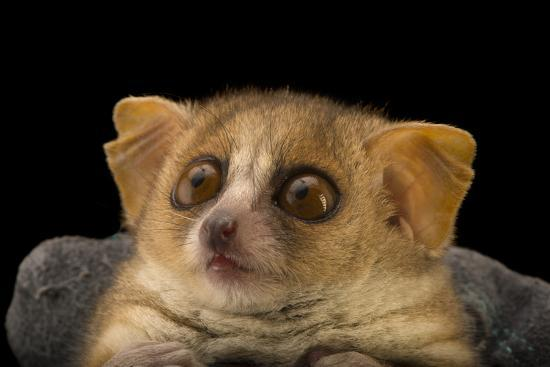

# Phylogenetic Regression {#w2PGLS}

```{r, echo=FALSE, eval=FALSE, message=FALSE}
knitr::opts_chunk$set(echo = TRUE)
knitr::opts_chunk$set(comment = '')
knitr::opts_chunk$set(fig.pos = 'H', fig.height = 5, fig.align = 'center')
knitr::opts_knit$set(root.dir = '~/Google Drive/University of Liverpool/CRG19:20/Comparative Methods Course/04 - PGLS Regression/PGLS files')
require(magick)
require(png)
require(ggplot2)
require(phytools)
require(caper)
require(dplyr)
```

This chapter will show you how to perform phylogenetically correct regression analyses on continuous data in R. As usual, remember to set your working directory to wherever you have saved the necessary files. 

## Data

Let's load up some example primate data. You should see the dataframe appear in your environment. If you inspect the object, you will find a number of continuous variables in there for us to investigate.
```{r, echo=TRUE, eval=FALSE}
primate.data <- read.table("primates_data.txt", header = T)
names(primate.data)
```

```{r, echo=FALSE, eval=TRUE}
primate.data <- read.table("~/Google Drive/University of Liverpool/GitHub Stuff/bookdownCRG/Data/primates_data.txt", header = T)
names(primate.data)
```

## Linear Regression
Simple linear regression will be familiar to you from LIFE223. The principle is to find out what the relationship is between two or more variables.

To see if body mass and gestation length are related in primate, the best way to go would seem to be a traditional linear regression. The funtion to perform an ordinary least squares linear regression is **lm()**. The first argument is our model, stating in this case that body mass predicts gestation length. Then we specify the data object to tell R where to find the data.
```{r, echo=TRUE, eval=TRUE}
m1 <- lm(GestationLen_d ~ log10(AdultBodyMass_g), data = primate.data)
```

You can use the summary function to see the output of your regression.
```{r, echo=TRUE, eval=TRUE}
summary(m1)
```

The key parts of our output are the coefficients table and the three lines of output below which contain the R^2^ value. Here, it's telling us that our model is a significant fit to the data as we might expect. Also, the mid-range R^2^ (0.50) is what we'd expect given the spread of data in the plot.

We can also plot this line with **ggplot** with the following code. To plot the regression line, add the function geom_smooth amd used the method "lm" to specify that I want a linear model plotted.
```{r, echo=TRUE, eval=TRUE, fig.align='center', message=FALSE, warning=FALSE}
library(ggplot2)
ggplot(data = primate.data, aes(x = log10(AdultBodyMass_g), y = GestationLen_d)) +
  geom_point() + 
  geom_smooth(method = "lm", se = FALSE)
```

## Phylogenetic Signal

As you know, the fact that comparative data points are not statistically independent is a problem for these kind of analyses. Therefore we need to run a phylogenetically corrected analysis.

Phylogenetic regression dates back a while and there have been many different ways to do it [@Grafen89;@Nunn11]. To understand the logic behind the method, we will first consider the concept of phylogenetic signal.

### Phylogenetic signal

Phylogenetic signal is defined as *the tendency for closely related species to resemble each other more than distantly related species*.

For example, body mass is (usually) a trait with a strong phylogenetic signal. What this means in primates is that although there is a broad range of body sizes from a few tens of grams up to around 200kg, the distribution of body masses closely follows the pattern of relatedness. Large primates like orangutan, gorillas, chimps and humans are all closely related for example.

The degree of phylogenetic signal in a trait is often described using the scaling parameter $\lambda$. $\lambda$ varies between 0 and 1 and is used to multiply the internal branch lengths so that the tree describes the pattern of variation in the trait.

For example, take the case on the left, where $\lambda$ = 1. In this case the tree is untransformed because the variation in the trait follows the structure of the tree. On the right, where $\lambda$ = 0, all the internal branch lengths have been multiplied by 0 and therefore collapsed. This "star phylogeny" describes a pattern of variation in which the trait varies at random with respect to the phylogeny. The trait is not equal across the tree but rather the variation in the trait does not correlate to the pattern of relatedness.
```{r,echo=F, eval=TRUE, fig.align='center', fig.height = 4}
par(mfrow = c(1,2))
par(mar = c(0.5,0.5,2,0.5))

tree <- pbtree(n = 13, scale = 42)
plot(tree, tip.color = "white",
     edge.width = 4, no.margin = F,
     main = expression(paste(lambda, "= 1")))

tree1 <- starTree(species = rep("A",13))
plot(tree1, tip.color = "white",
     edge.width = 4, no.margin = F, 
     main = expression(paste(lambda, "= 0")))

rm(tree, tree1)
par.default <- par(no.readonly = T)
par(par.default)
```

### caper

Let's run through some examples. There are a few packages that can run phylogenetic regressions in R but the one I usually go with is called caper (Comparative Analysis of Phylogenetics and Evolution in R) [@caper]. So first we'll need to load caper.
```{r, echo = TRUE, eval = FALSE}
library(caper)
```

```{r, echo = FALSE, eval = TRUE, message=FALSE, warning=FALSE}
library(caper)
library(ape)
primate.tree <- read.nexus("~/Google Drive/University of Liverpool/GitHub Stuff/bookdownCRG/Data/primate_tree.nex")
```

Now we can load up our phylogeny using read.nexus from the ape package.
```{r, echo=TRUE, eval=FALSE, warning=FALSE, message=FALSE}
library(ape)
primate.tree <- read.nexus("primate_tree.nex")
```

The regression command in **caper** (along with some other functions) requires the data and tree to be combined in a **comparative data object**. This type of object is simply a tree and comparative data set concatenated and is created using the function **comparative.data**. We need to specify the tree object, data object, column name in the data where species names are stored and whether we want a variance-covariance matrix included (we do).
```{r, echo=TRUE, eval=TRUE}
primates <- comparative.data(phy = primate.tree,     #Our tree
                             data = primate.data,    #Our data
                             names.col = Binomial,   #Data column with the species names
                             vcv = TRUE,             #Variance-covariance matrix
                             na.omit = FALSE,        #We don't want to drop missing data
                             warn.dropped = TRUE)
```

This warning message isn't really a problem. If you look at the tree and data I provided, you'll see that the tree has about 200 species but the datafile contains data for only 91. Therefore we expected R to drop some species when compiling the comparative data object. In fact, we asked it warn us if it did so!

We can inspect the structure of the comparative data object using **str** if necessary. You should see that the object contains both the tree and the data. Either one of these (pruned from the larger objects we specified) can be extracted again if needed.
```{r, eval = TRUE, echo=TRUE}
str(primates)
```

### Estimating Phylogenetic Signal

Let's estimate the phylogenetic signal of gestation length in primates. The key is to remember that we need to call our comparative data object and not the data file we loaded up at the start. We're running the trait on its own (hence the "~ 1") and estimating lambda by maximum likelihood.
```{r, echo=TRUE, eval=TRUE}
signal <- pgls(log10(GestationLen_d) ~ 1,
               data = primates,
               lambda = "ML")
summary(signal)
```

This output has a lot in common with a basic regression output. That's because it is one! We used the **pgls** function which performs a regression with phylogenetic correction. Because we included no predictors, the value of $\lambda$ we estimate here corresponds only to this one trait.

The key part for us is the **Branch length transformations** section of the output. $\kappa$ and $\delta$ are fixed at 1 and so we aren't concerned with those for now. $\lambda$ is estimated at 0.957. That's a pretty strong phylogenetic signal.

We also have lower bound and upper bound tests. We can see that $\lambda$ is significantly different from the lower bound of 0 (p < 2.2 x 10^-16^).

The upper bound test shows us that $\lambda$ is (narrowly) not significantly different from 1 (p = 0.051). This means that we can assume that gestation length has evolved by Brownian motion, in which case $\lambda$ would equal 1 and the variation in trait would simply reflect the pattern of relatedness amongst species.

## Phylogenetic Regression

Now let's have a go at performing a PGLS regression!

Let's say we have an idea that larger species of primate have longer gestations. Our plot seems to back this up but how strong is this relationship?
```{r, echo=FALSE, eval=TRUE}
ggplot(data = primate.data) +
  geom_point(mapping = aes(x = log10(AdultBodyMass_g), y = GestationLen_d),
             colour = "blue") +
  labs(x = "Log Body Mass", y = "Gestation Length")
```

We found earlier that there does seem to be a relationship but ordinary least squares linear regression can't be relied upon in this situation. This is because of the statistical non-independence of data points due to shared evolutionary history!

A **phylogenetic generalised least squares regression** (PGLS) uses a covariance matrix to correct the analysis for this statistical non-independence. Put simply, the PGLS assumes the residuals are more similar in more closely related species rather than being randomly distributed as in linear regression.

As you've already seen, the function we need here is **pgls**. The model is constructed exactly as before but this time, we need to construct a full model. We'll be estimating $\lambda$ by maximum likelihood again.
```{r, echo=TRUE, eval=TRUE}
m2 <- pgls(GestationLen_d ~ log10(AdultBodyMass_g), data = primates, lambda = "ML")
summary(m2)
```

As you can see, our model is a significant fit to the data (F = 33.3, R^2^ = 0.29, p = 1.39 x 10^-7^). More importantly, We've confirmed that body size has a positive effect on gestation length ($\beta$ = 33.75, s.e. = 5.85, p = 1.39 x 10^-7^). Time to plot!
```{r, echo = FALSE, eval=TRUE}
m1 <- lm(GestationLen_d ~ log10(AdultBodyMass_g), 
         data = primates$data)
```

A brief note here. The syntax to get **ggplot** to do this is a little more complex than base graphics (where we can just use abline(m2)!). Here I've plotted both the OLS (blue) and PGLS (red) lines so you can see how they differ.
```{r, echo=TRUE, eval = TRUE, message=FALSE, warning = FALSE}
library(dplyr)
primates$data %>%
  mutate(my_model = predict(m2)) %>%
  ggplot() +
  geom_point(aes(log10(AdultBodyMass_g), GestationLen_d)) +
  geom_line(aes(log10(AdultBodyMass_g), my_model), 
            colour = "red", lwd = 1) +
  geom_smooth(aes(log10(AdultBodyMass_g), GestationLen_d), 
              method = 'lm', se = FALSE) +
  labs(x = "Log Body Mass", y = "Gestation Length") +
  geom_text(x = 2, y = 230, label = "PGLS", colour = "red", size = 4) +
  geom_text(x = 2, y = 218, label = "OLS", colour = "blue", size = 4)
```

### Model Checking

That's the basic model run nicely. Now, we need to run some diagnostic checks. We should start with the likelihood surface of $\lambda$ since we estimated it by maximum likelihood.

We begin by using the **pgls.profile** function to extract the likelihoods and then simply plot them. What we are looking for is a single peak around our estimated value. If we get a flat surface or multiple peaks, there might be an issue somewhere.
```{r, echo=TRUE, eval=TRUE}
lambda.profile <- pgls.profile(m2, which = "lambda")
plot(lambda.profile)
```

This plot describes the log likelihood of $\lambda$ across its possible range of values (0 - 1). We can clearly see that the likelihood is highest around a single point around 0.8. Check back against the model output earlier to see if this is what we would expect.

Next we need to identify any outliers in the model residuals. The first step here is to extract the residuals from the model, making sure to tell R that we want the phylogenetic residuals. The model output of pgls actually stores both phylogenetic and non-phylogenetic residuals. We can then standardise the residuals by dividing through by the square root of the variance.
```{r, echo=TRUE, eval=TRUE}
res <- residuals(m2, phylo = TRUE)
res <- res/sqrt(var(res))[1]
```

The general rule of thumb is that any standardised residual with an absolute value greater than 3 is an outlier and needs to be removed from the analysis. Here, I'm just assigning the species names to the **res** object so we can tell which species are the outliers (if any).
```{r, echo=TRUE, eval=TRUE}
rownames(res) <- rownames(m2$residuals)
rownames(res)[abs(res)>3]
```

Outliers! Maybe they're causing problems and maybe they aren't. We need to check that by re-running our analysis without them. A simple line of code will take our existing comparative data object and drop out the named outliers.
```{r, echo=TRUE, eval=TRUE}
primates.nooutliers <- primates[-which(abs(res)>3),]
```

Now simply re-run the model, remembering to direct R to the new data object.
```{r, echo=TRUE, eval=TRUE}
m3 <- pgls(GestationLen_d ~ log10(AdultBodyMass_g),
           data = primates.nooutliers, lambda = "ML")
summary(m3)
```

The results have barely changed. So it seems that although those two lemurs were outliers, they weren't effecting the analysis too much. Let's check for outliers in this new model.
```{r, echo=TRUE, eval=TRUE}
res <- residuals(m3, phylo = TRUE)
res <- res/sqrt(var(res))[1]
rownames(res) <- rownames(m3$residuals)
rownames(res)[abs(res)>3]
```

Another one! Don't worry. This can happen. We need to drop the new outlier again to run the same checks.

Finally, we can check the diagnostic plots of the model. I've included some lines to help arrange the plots. To view the plots for model diagnostics, we can simply plot the model object!
```{r, echo=TRUE, eval=TRUE, fig.height = 7}
par.default <- par(no.readonly = T) #Save default plotting parameters
par(mfrow=c(2,2)) #Set the plot window to show 4 different plots
plot(m3)
par(par.default) #Reset plot window to default
```

The top left panel shows the distribution of our residuals. We can see a bump near +3. That will be our outlier that needs to be dropped before we proceed any further. The top right plot closely approximates a straight line so that's good. The bottom left shows no real pattern which is also good. The bottom right graph should show a correlation (and it seems to) with the points more or less equally scattered above and below the 45^o^ diagonal. Along that line, the observed and fitted values would be exactly equal.

## Conclusion

So that's how to perform a simple PGLS analysis. This kind of analysis is great for attempting make causal connections between traits of extant species, thus inferring a connection over evolutionary history. For example, we hypothesised that the reason some primates have longer gestation periods is that they have larger body sizes and the PGLS confirmed our suspicion. More complex regressions can include multpile predictors and that's what we'll look at next.

By the way, always make sure to check your models for outliers! In this analysis the gray mouse lemur was an outlier and we had to drop it. Outliers like this can throw off your analysis. If we hadn't checked, we would have presented the analysis in a paper and then had it invalidated when someone checked up on it. Fortunately in this case, the outliers didn't really change the outcome so the gray mouse lemur is off the hook. Look how relieved he is!

```{r, echo = FALSE, eval=TRUE}

```

