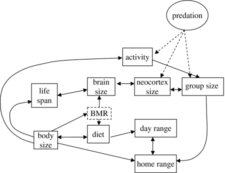
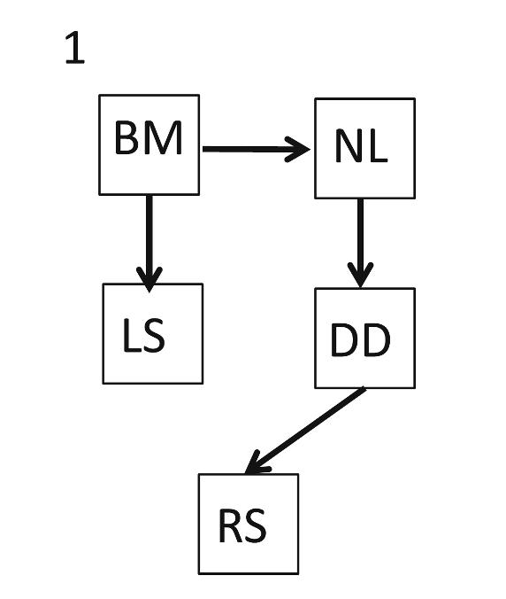

# Path Analysis {#pathanalysis}

```{r, include=FALSE, eval = FALSE}
knitr::opts_chunk$set(echo = TRUE)
knitr::opts_chunk$set(comment = '')
knitr::opts_chunk$set(fig.pos = 'H', fig.height = 5, fig.align = 'center')
knitr::opts_knit$set(root.dir = '~/Google Drive/University of Liverpool/CRG19:20/05 - Path analysis/Path Analysis Files')
require(devtools)
require(btw)
require(geiger)
require(ape)
require(phytools)
require(caper)
require(ggplot2)
require(phylopath)
require(ggforce)
```

## PGLS regression

Let's have a closer look at using PGLS regression in statistical analyses. We'll be using the same data and tree from the previous chapter.
```{r, echo=FALSE, eval=TRUE, message=FALSE, warning=FALSE}
require(ape)
primate.tree<-read.nexus("~/Google Drive/University of Liverpool/GitHub Stuff/bookdownCRG/Data/primate_tree.nex")
primate.data<-read.table("~/Google Drive/University of Liverpool/GitHub Stuff/bookdownCRG/Data/primates_data.txt",header=T)
```

If we have a look into the data file provided, we notice a number of continuous variables describing primates. Let's say we're interested in what makes some primates live such long lives. The natural thing to do, is run a PGLS regression with longevity as the outcome.
```{r, echo=TRUE, eval=TRUE}
names(primate.data)
```

First, we need a comparative data object combining our data and tree.
```{r, echo=TRUE, eval=TRUE, message=FALSE, warning=FALSE}
library(caper)
primates<-comparative.data(phy = primate.tree, data = primate.data, 
                           names.col = Binomial, vcv = TRUE, 
                           na.omit = FALSE, warn.dropped = FALSE)
```

Now we can assemble and run our model. We want to predict longevity. Many things might influence longevity so how about something like this.

$$ \text{Longevity = Body Mass + Gestation + Home Range + Group Size}$$

Pretty much all of those will need to be log transformed in our model. We can do this ahead of time to make the code easier.
```{r, echo=TRUE, eval=TRUE}
primates$data$log.mass <- log10(primates$data$AdultBodyMass_g)
primates$data$log.gestation <- log10(primates$data$GestationLen_d)
primates$data$log.range <- log10(primates$data$HomeRange_km2)
primates$data$log.group <- log10(primates$data$SocialGroupSize)
primates$data$log.lifespan <- log10(primates$data$MaxLongevity_m)
```

Now we can run the model just as we did in the previous chapter.
```{r, echo=TRUE, eval=TRUE}
m1 <- pgls(log.lifespan ~ log.mass + log.gestation + log.range + log.group,
           data = primates, lambda = "ML")
summary(m1)
```

We have a $\lambda$ of 0.683. This is **not** the phylogenetic signal of lifespan or any other variable in the model. Rather, it is the phylogenetic signal of the residuals of the model. As you can see, there clearly is a signal here and it's different from 0 (p = 0.03) and 1 (p < 0.001). However, as you can see from the lambda profile below, the CIs are very wide.

```{r, echo=TRUE, eval=TRUE}
plot(pgls.profile(m1, which = "lambda"))
```

Not to worry! On we go. The coefficients table in the results output is what we really want to look at here. We can see that the overall fit of the model is significant (R^2^ = 0.23, p < 0.001) but a little underwhelming. The only significant predictor of longevity in our model is body mass ($\beta$ = 0.13, se = 0.05, p = 0.006). Our other variables do not significantly predict lifespan. 

However, we're not done yet! This is where we can employ deletion testing. It is pretty clear that gestation is the most useless component of our model ($\beta$ = -0.04, se = 0.21, p = 0.86). An effect size around 0 with a large standard error and p-value is something we don't need in our lives. So we can re-run the model dropping this variable.

IMPORTANT: ONLY DROP ONE VARIABLE AT A TIME!
```{r, echo=TRUE, eval=TRUE}
m2 <- pgls(log.lifespan ~ log.mass + log.range + log.group,
           data = primates, lambda = "ML")
summary(m2)
```

Our new output presents a similar picture. Body mass is significantly predicting longevity. This time we might want to look at dropping group size ($\beta$ = 0.03, se = 0.04, p = 0.46).
```{r, echo=TRUE, eval=TRUE}
m3 <- pgls(log.lifespan ~ log.mass + log.range,
           data = primates, lambda = "ML")
summary(m3)
```

Now we're getting somewhere. We have reduced our maximal model to something a little more descriptive. We can keep going with this until we have eliminated all non-significant variables. However, at each stage, we should make sure that dropping variables doesn't reduce our model fit! At each stage so far, the model fit has got better (see the bottom line of each output). What would happen if you also dropped range?

Also keep in mind that the model we've built here doesn't use any interaction terms. These can be included just as in any other model and treated in the same way!

## Variance Inflation

In analyses like the one above, it is not uncommon to run into problems. When constructing a regression model, it is important to make sure your predictor variables don't correlate.
```{r, echo=F, eval=TRUE, message=FALSE, results="hide", warning=FALSE}
require(ggplot2)
ggplot(data = primate.data) +
  geom_point(aes(x = AdultBodyMass_g, y = GestationLen_d), cex = 0.5) +
  scale_y_log10() +
  scale_x_log10() +
  geom_smooth(aes(x = AdultBodyMass_g, y = GestationLen_d), method = "lm", lwd = .5, se = FALSE) +
  labs(x = "Body Mass (g)", y = "Gestation Length (days)")
```

As we can see here, this is clearly not the case. Exactly how much of a problem this can be is uncertain. Strong correlations are hugely problematic but weak ones are probably not that big a deal.

Imagine if we had two strongly correlated predictor variables in a model. How would we determine which one was causing the variation in our outcome? The more strongly correlated these predictors are, the more difficult it becomes to use them both to predict an outcome. This is called **variance inflation** (or multicollinearity).

The function **vif** in the package **car** [@car] calculates the variance inflation factor of a model. Here we can see that every variable in our model has a VIF greater than 1, indicating we do have some multicollinearity. However, there is no critical value beyond which variance inflation becomes a problem. As a general rule of thumb, a value that exceeds 5 is considered enough of a problem that you shouldn't trust your results.
```{r, echo=TRUE, eval=TRUE, message=FALSE, warning=FALSE}
m1.1 <- lm(primates$data$log.lifespan ~ primates$data$log.mass + 
             primates$data$log.gestation + primates$data$log.range + 
             primates$data$log.group)
library(car)
vif(m1.1)
```

So it may be that we don't have a problem here and we're probably ok to proceed. Note however that I had to calculate VIF for the uncorrected model (without phylogenetic correction) so the true values for the pgls may differ slightly.

## Path Analysis

In comparative analyses, multicollinearity is to be expected. Many traits of a given animal are influenced by other traits. To solve this problem, we have path analysis [@Hardenberg13;@Gonzalez14].

In path analysis, we take a number of variables and define a **causal model**. This model consists of **vertices** (our variables) and **arrows** which define the relationships between the variables. This is an example of such a model.

```{r, echo = FALSE, eval=TRUE, fig.cap="Predicted pathway model of primate brain evolution taken from Dunbar and Shultz (2007).", fig.height=7, fig.align='center'}

```

Models like this one can be complex with many arrows showing a complex network of relationships. This is fairly typical of biological systems! If you study it closely, you'll be able to see that it describes the interactions between variables. For example, *body size* directly influences *lifespan*, *home range*, *activity*, *BMR* and *diet*. The relationships described by these arrows represent a causal hypothesis.

Confirmatory path analysis was developed to test causal hypotheses that can be represented by **Directed Acyclic Graphs** (DAGs) [@Shipley00b]. DAG is the term given to the graphical representation of the variables and the hypothesised relationships between them. We can test if a DAG is a reasonable hypothesis using a principle called **distance-sepearation** or d-sep for short [@Shipley00b].

D-sep tests **conditional independencies** in your DAG. If two vertices are not connected by an arrow, then the model implies that these variables are not causally linked.

```{r, echo = FALSE, eval=TRUE, fig.cap="Example of a simple directed acyclic graph from Gonzalez-Voyer and Von Hardenberg 2014."}

```

This example DAG contains a number of independencies. **BM** and **DD** are unconnected and therefore should be independent if this model is reasonable. We can actually build a model to test that indepedency as follows:

$$ \text{DD = BM + NL}$$

Note that **NL** must be included as a predictor of **DD** as it is in the model. If **BM** and **DD** are truly independent, then this model would return no statistically significant relationship between them.

This is not the only independency to test for. **LS** and **RS**, **DD** and **LS**, **NL** and **LS**, and **BM** and **RS** are all also independent under the DAG and so need to be tested in the same way. The probabilities of all these tests are combined using Fisher's C test [@Shipley16]. 

To calculate C, we add the natural logs of all the p-values describing the supposed independencies using the formula below where *k* is the number of indepedence tests.

$$ C = -2 \sum_{i=1}^k \text{ln(p}_i) $$

Using this approach for numerous models, we can begin to compare competeing hypotheses and select the most appropriate model. To do so, we can calculate the C-statistic Information Criterion with a modification for small sample sizes (CICc) with the following formula where *n* is the sample size, *q* is the number of parameters and *C* is the C-statistic.

$$ \text{CICc} = C + 2q \times \frac{n}{(n - q - 1)}$$

CICc is an information theory based approach. Essentially, the smaller the value of CICc the better the fit of the model to the data. There's no hard limit for distinguishing between two models but the general rule of thumb is that a difference in CICc of more than 2 mean that one model is a better fit than the other. Within 2 and we can't reliably distinguish between the models.

So far, I've taken you through confirmatory path analysis but I haven't mentioned phylogentic control at all. Path analysis without phylogenetic control is performed using generalised linear models (glms)

Let's see how this works with an example.

### Example

For this demonstration I'm loading in some new data [@Hardenberg13;@Gonzalez14]. The data contains information on five continuous variables for 100 species from a group of mammals called the *Rhinogradentia* [@snouters].
```{r, echo=TRUE, eval=FALSE}
rhino.dat <- read.csv("rhino.csv")
rownames(rhino.dat) <- rhino.dat$SP
rhino.tree <- read.tree("rhino.tree")
```
```{r, echo=FALSE, eval=TRUE}
rhino.dat <- read.csv("~/Google Drive/University of Liverpool/GitHub Stuff/bookdownCRG/Data/rhino.csv")
rownames(rhino.dat) <- rhino.dat$SP
rhino.tree <- read.tree("~/Google Drive/University of Liverpool/GitHub Stuff/bookdownCRG/Data/rhino.tree")
```

Path analysis is something I used to do manually, model by model. However, as is usual in comparative studies, someone has written a package called **phylopath** that does it all quite simply [@phylopath]. We'll also need **ggforce** to help with plotting later on [@ggforce].
```{r, eval=FALSE, echo=TRUE}
install.packages("phylopath")
install.packages("ggforce")
require(phylopath)
require(ggforce)
```

```{r, echo=FALSE, eval=TRUE, warning=FALSE, message=FALSE}
require(phylopath)
require(ggforce)
```

The first step is to define the models using the function **define_model_set**. Take your time over this! Typos will be very important. In this instance, let's reproduce the example DAG from above. The formulae are passed in the same style as any formula in R.
```{r, echo=TRUE, eval=TRUE}
m <- define_model_set(
  Example = c(RS ~ DD, LS ~ BM, NL ~ BM, DD ~ NL)
)
```

We can plot the model using the function **plot_model_set**. The extra arguments here clean up the plot a little. **box_x** and **box_y** create a box around the vertices to force the arrows not to overlap with the text. **text_size** and **edge_width** set the font size and arrow size respectively.
```{r, echo=TRUE, eval = TRUE, message=FALSE, warning=FALSE}
plot_model_set(m, text_size = 10,
               box_x = 18, box_y = 16,
               edge_width = 2)
```

The layout isn't exactly the same as the previous diagram but we can manipulate that with the argument **manual_layout** if we wish. We need to create a dataframe with x and y coordinates for the final plots. We can also set the arrows to be straight by setting **curvature** to be 0.
```{r, echo=TRUE, eval = TRUE, message=FALSE, warning=FALSE}
pos <- data.frame(names = c("RS", "DD", "NL", "BM", "LS"),
                  x = c(1,1.5,1.5,.5,.5),
                  y = c(0,.5,1,1,.5))
plot_model_set(m, text_size = 10, box_x = 18, box_y = 16,
               edge_width = 2, manual_layout = pos, curvature = 0)
```

For the full analysis, let's define a number of possible models and try and see which best describes the data. We start with **define_model_set** and pass lists of formulae to each model which here I have named numerically 1 to 9. We've also passed some formulae to the **.common** option as these formulae are present in every model. This saves a fair bit of repetition.
```{r, echo=TRUE, eval=TRUE}
m <- define_model_set(
  one   = c(RS ~ DD),
  two   = c(DD ~ NL, RS ~ LS + DD),
  three = c(RS ~ NL),
  four  = c(RS ~ BM + NL),
  five  = c(RS ~ BM + NL + DD),
  six   = c(NL ~ RS, RS ~ BM),
  seven = c(NL ~ RS, RS ~ LS + BM),
  eight = c(NL ~ RS),
  nine  = c(NL ~ RS, RS ~ LS),
  .common = c(LS ~ BM, NL ~ BM, DD ~ NL)
)
```

Because this is a complex step, ALWAYS check your **Directed Acyclic Graphs** (DAGs) describing your models look as you expect them to.
```{r, echo=TRUE, eval=TRUE, warning = FALSE, message = FALSE, fig.height=9}
plot_model_set(m, text_size = 6, box_x = 12, box_y = 10,
               edge_width = 1.25, manual_layout = pos, curvature = 0)
```

If we are doing this by hand, now we need to identify d-separation statements and test conditional independencies. **Phylopath** does it all for us. To interpret the final results, you really need to understand what happens in this step so take it slow and revisit the explanations above. You can also refer to the methods papers which explain things very well [@Hardenberg13;@Gonzalez14].
```{r, echo=TRUE, eval=TRUE, message=FALSE, warning=FALSE}
results <- phylo_path(m, data = rhino.dat, tree = rhino.tree, model = "lambda")
```

If we call up the results, we get some basic information. Here our results contain the models and the PGLS analyses used to evaluate each model.
```{r, echo=TRUE, eval=TRUE}
results
```

The summary of the results object gives us the table for model comparisons. For each model we have all the key stats. We can see that the top six models are not rejected based on d-separation (p > 0.05). Pay particular attention to the CICc (C-statistic Information Criterion) and $\Delta$CICc. You'll notice that the table is helpfully sorted for us by $\Delta$CICc. 
```{r, echo=TRUE, eval=TRUE}
summary(results)
```

We can plot the summary of results and we are presented with a very useful plot, showing us the degree of support for each model. In this case, the top 3 (models eight, six and four) are within 2 CICc of each other and therefore have roughly equal statistical support.
```{r, echo=TRUE, eval=TRUE, warning=FALSE, message=FALSE}
plot(summary(results))
```

For now, let's just plot the best model.
```{r, echo=TRUE, eval=TRUE, message = FALSE, warning=FALSE}
best_model <- best(results)
plot(best_model, manual_layout = pos)
```

The numbers and width of each arrow represent the path coefficents (effect sizes). The blue colour represents a positive relationship. A negative relationship would be red. Remember here that we have a few models with roughly equivalent support. We can average these models if this happens. The **cut_off** argument tells us where to place the limit of support. By default this is 2 CICc and so the function **average** will only average the models that fall within 2 CICc of the best supported model.

```{r, echo=TRUE, eval=TRUE, warning=F, message=F}
av.model <- average(results, cut_off = 2)
plot(av.model, algorithm = "mds", curvature = 0.1, manual_layout = pos)
```

## Conclusion
So that's a path analysis. I've skirted over some details here because this particular method is complex and the package used here strips out a lot of the manual effort needed to do a path analysis. This is a good thing. It cuts down the computing time and means you don't have to write as much code. However, it does mean you can run the analysis without really understanding it. This could be a problem when you need to write it up or present it so be sure you know what's happening.

For getting to the end, here's a slightly confused looking monkey.

```{r, echo = FALSE, eval=TRUE}

```

