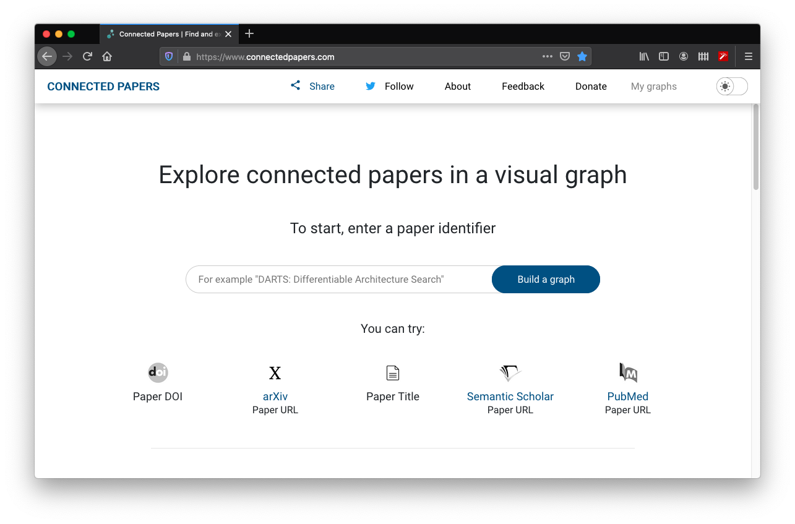
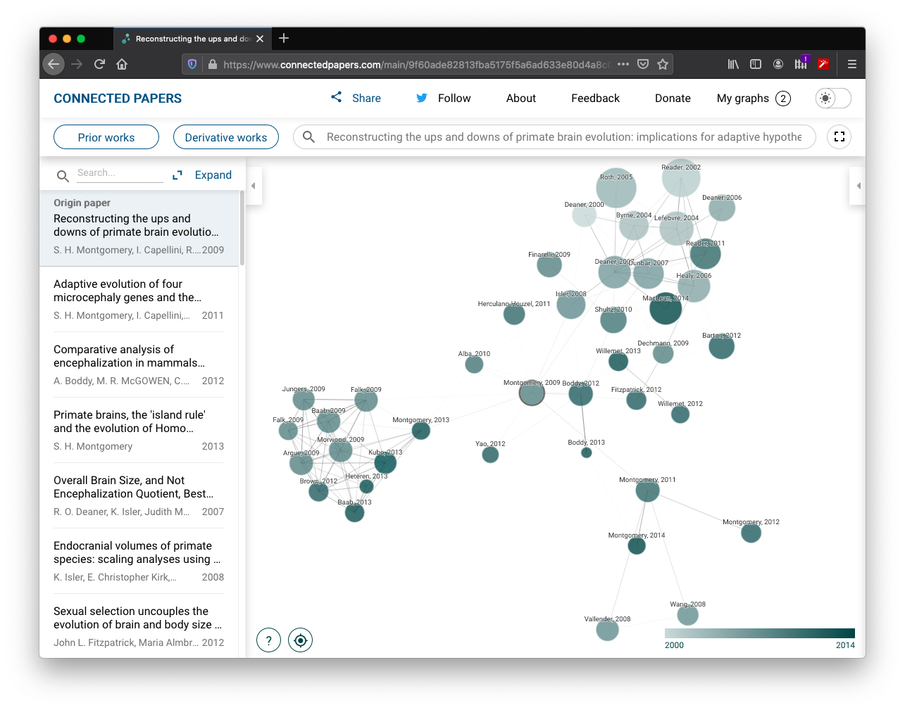
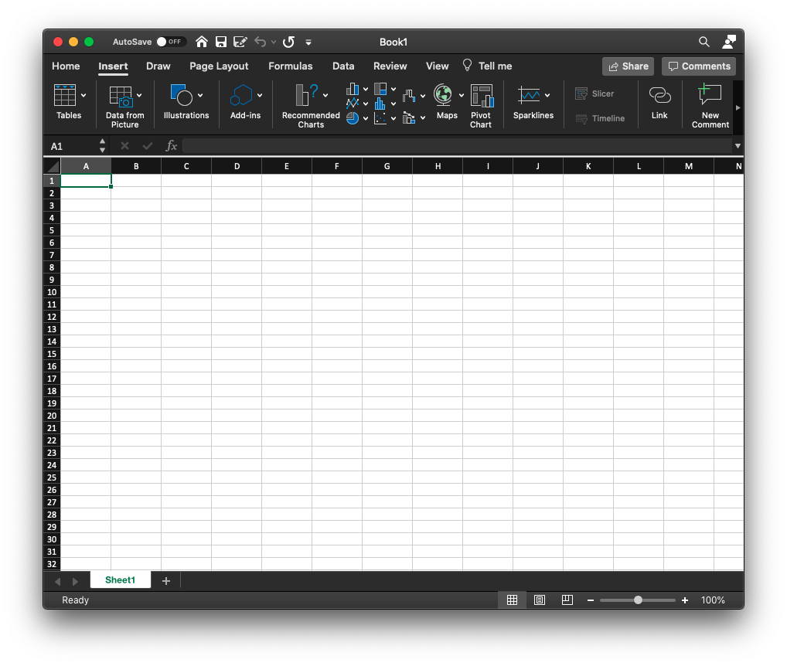

# Tips and Tricks

This section will be populated with tips to help with a general comparative research project. Some will be quite specific solutions to problems that have popped up but don't quite fit into one of the previous chapters. Others will be much more generic and can be applied in many different situations.

## Literature searching with *Connected Papers*

Seraching through the  literature can be a daunting task. The volume of information available can be overwhelming. A rcently developed tool could make this task a little easier. [Connected Papers][connectedpapers] is an online tool that allows you to visualise how a paper fits into the wider body of the literature.

The tool is connected to Semantic Scholar, an online repository of scientific papers. To use the tool, simply enter the title of a paper (or URL/doi) into the search bar on the home page.

```{r, echo = FALSE, eval=TRUE, fig.align='center'}

```

Once the search function has located the corrected paper, select **Build Graph** and the tool will build a network-style graph of papers that are similar to the one you have chosen.

```{r, echo = FALSE, eval=TRUE, fig.align='center'}

```

Interpreting this graph is very useful. Papers are arranged by **similarity** meaning that the bibliographies of each paper are compared looking for overlapping bilbliographies. This means that this is not just a map of papers that cite each other (although many are likely to cite each other). It is a map of papers that write about similar things and therefore cite similar sources.

Clusters of papers are more similar. In the graph above you can see three clusters of papers. One is very tightly clustered indicating strong overlap in bibliography whereas the others are slightly more diffuse. You can also call up **Prior works** and **Derivative works** allowing you to investigate papers that cite and are cited by the papers in the graph.

This can be a really useful way to approach a literature search. Often it can be easy to find a paper that is relevant to your topic and not search too much further. This means you can miss the broader context of the paper and may mean you end up citing one paper without citing others that might be more up-to-date, contradictory or otherwise relevant.

## Extracting data from a PDF using Excel

Microsoft Excel is either a really useful programme or a frustrating mess depending on who you ask and possibly how long it's been since their last coffee. Whatever you think of the programme, it's quite likely that you'll be using it to edit/store your data. 

Many authors make their data available as .csv files (comma separated values) which are easily readable by Excel (amongst others). However, sometimes this is not the case. Data are sometimes presented in neatly formatted tables in a PDF. 

Quite recently, Microsoft have introduced a feature to Excel that some project students have found useful in the past. If you navigate to the **Insert** tab you will see the option to insert **Data from picture**.

```{r, echo = FALSE, eval=TRUE, fig.align='center'}

```

This option allows you to upload a picture (such as a screenshot of a pdf or page from a book) into Excel. Once you've selected the picture, Excel will use its AI to process the image and convert it into a table. Once complete, Excel will present a draft of the table to insert for you to check manually. It is very important to check this for missing decimal points, misspellings and similar mistakes that the AI may have made.

If you can't get hold of data any other way, this is a great timesaver that will prevent you typing it all out by hand!

## DataEditR

Traditionally, if you find an error in your data there are a couple of ways to solve the problem. You could use the **tidyverse** suite of packages, within which there are many functions for manipulating data. Alternatively, you could go to Excel (or wherever your data is stored) and edit the source file before reloading it into R. Which method you choose is probably dependent on your experience and comfort with R.

A third option is to use the package **DataEditR** [@dataeditr]. This package opens up a dataset in an interactive viewer which the user can then edit manually as they would when using Excel. It's a really useful add-on package to R and it has a truly excellent associated Github site [here][dataeditr] which takes you through the key features and how to use them.


[connectedpapers]: https://www.connectedpapers.com "connectedpapers"
[dataeditr]: https://dillonhammill.github.io/DataEditR/articles/DataEditR.html "dataeditr"